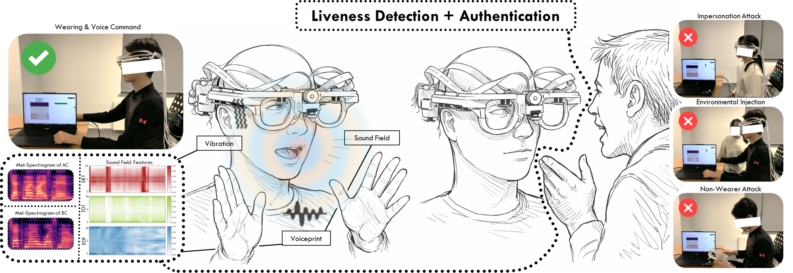
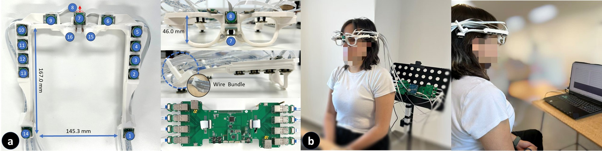
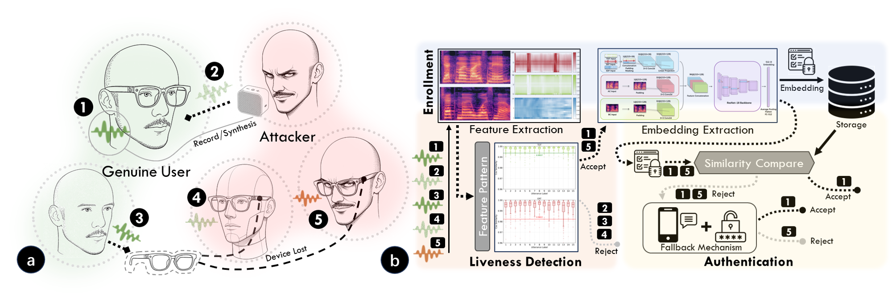

<div align="center">

# AuthGlass

**Benchmarking Voice Liveness Detection and Authentication on Smart Glasses via Comprehensive Acoustic Features**

[](https://doi.org/10.1145/3831980)
[](https://doi.org/10.1145/3831980)
[](LICENSE)
[](#-release-status)

Weiye Xu<sup>1</sup> · Zhang Jiang<sup>1</sup> · Siqi Zheng<sup>1</sup> · Xiyuxing Zhang<sup>1</sup> · Changhao Zhang<sup>2</sup> · Jian Liu<sup>2</sup> · Weiqiang Wang<sup>2</sup> · Yuntao Wang<sup>1†</sup>

<sup>1</sup>Tsinghua University &nbsp;&nbsp; <sup>2</sup>Ant Group &nbsp;&nbsp; <sup>†</sup>Corresponding author

*Proc. ACM Interact. Mob. Wearable Ubiquitous Technol. (IMWUT), Vol. 10, No. 3, Article 180, September 2026*

</div>

<p align="center">
  
</p>

---

## 🚧 Release Status

> **This repository is a placeholder. The dataset, code, and hardware documentation are being prepared for release and will be published here.**

We are currently finalizing anonymization checks, packaging the multi-channel recordings, and cleaning up the reference implementation. Watch ⭐ this repository to be notified when each artifact lands.

| Artifact | Contents | Status |
| :-- | :-- | :-- |
| 📄 **Paper** | Camera-ready PDF + supplementary material | 🔜 Coming soon |
| 🗂️ **AuthGlass dataset** | 16-channel, 96 kHz recordings — genuine + attack samples, with segmentation annotations | 🔜 Coming soon |
| 🧠 **AuthG-Live** | Sound-field-based voice liveness detection (reference implementation) | 🔜 Coming soon |
| 🧠 **AuthG-Net** | Multi-acoustic-modal authentication model (reference implementation) | 🔜 Coming soon |
| 📊 **Benchmark suite** | Data splits, evaluation protocols, and baseline re-implementations for all 4 tasks | 🔜 Coming soon |
| 🕶️ **Hardware** | DIY smart-glasses prototype: frame models, parts sourcing, and assembly guide | 🔜 Coming soon |

**Questions in the meantime?** Open an [issue](../../issues) or email the corresponding authors (see [Contact](#-contact)).

---

## 📖 Overview

Smart glasses have made voice the dominant input modality — it is hands-free, natural, and needs no extra sensors. But that same openness to ambient audio exposes voice interfaces to replay, injection, and impersonation attacks, and **no public dataset exists for voice liveness detection and authentication in the smart-glasses form factor**.

AuthGlass closes that gap on three fronts:

1. **A dataset.** 16-channel synchronized air- and bone-conducted audio at 96 kHz from 42 participants, plus matched attack samples spanning two attack categories and seven attack settings.
2. **Two methods.** *AuthG-Live*, a sound-field-based liveness detector that trains **only on genuine speech** and therefore generalizes to unseen attacks; and *AuthG-Net*, a multi-acoustic-modal authentication model that fuses voiceprint, vibration, and sound-field cues with domain-adversarial learning for passphrase independence.
3. **A benchmark.** Seven liveness detection methods and four authentication methods, re-implemented and adapted to multi-channel input, evaluated across four tasks.

> **Abstract.** With the rapid advancement of smart glasses, voice interaction has been widely adopted due to its naturalness and convenience. However, its practical deployment is often undermined by vulnerability to spoofing attacks, while no public dataset currently exists for voice liveness detection and authentication in smart-glasses scenarios. To address this challenge, we first collect a multi-acoustic-modal dataset comprising 16-channel audio data from 42 subjects, along with corresponding attack samples covering two attack categories. Based on insights derived from this collected data, we propose AuthG-Live, a sound-field-based voice liveness detection method, and AuthG-Net, a multi-acoustic-modal authentication model. We further benchmark seven voice liveness detection methods and four authentication methods across diverse acoustic modalities. The results demonstrate that our proposed approach achieves state-of-the-art performance on four benchmark tasks, and extensive ablation studies validate the generalizability of our methods under real-world constraints. Finally, we release this dataset, termed AuthGlass, to facilitate future research on voice liveness detection and authentication for smart glasses.

---

## 🗂️ The AuthGlass Dataset

<p align="center">
  
</p>

To our knowledge, AuthGlass is the first open acoustic dataset collected on a smart-glasses form factor for authentication and liveness detection.

| | |
| :-- | :-- |
| **Participants** | 42 (28 male / 14 female), aged 18–42 (mean 24.6 ± 4.3) |
| **Channels** | 16 synchronized — 14 air-conduction (AC) + 2 bone-conduction (BC) |
| **Sampling rate** | 96 kHz (downsamplable to 48 / 32 / 16 kHz for commodity-device simulation) |
| **Passphrases** | 15 everyday voice commands (2–5 words), 3 volume levels × 2 repeats = 6 per phrase |
| **Genuine samples** | 42 × 15 × 6 = **3,780** utterances |
| **Wearer-based attacks** | 3,780 samples (GRAS 45BC KEMAR torso–mouth simulator replay) |
| **Environment-based attacks** | 3,780 × 6 positions = **22,680** samples (loudspeaker at 4 directions × 100 cm, plus 50 cm and 25 cm frontal) |
| **Annotations** | MAUS forced-alignment segmentation, manually verified; subject and utterance IDs |
| **Ethics** | IRB-approved; all participants gave informed consent for publication of anonymized data |

**Modalities.** Channel 7 (centre, downward-facing) provides the **AC** reference; the higher-energy nose-pad channel (15/16) provides **BC**; the remaining AC channels (1–6, 8–14) provide **SF** (sound field) relative to Channel 7.

**Sound-field features.** Energy Ratio over Time (**ERT**), Time Delay over Time (**TDT**), and Energy Distribution over Frequency (**EDF**) — see [`docs/dataset.md`](docs/dataset.md).

---

## 🛡️ Threat Model

<p align="center">
  
</p>

Four adversarial scenarios, each mapped to the pipeline stage expected to reject it:

| # | Scenario | Rejected at |
| :-: | :-- | :-- |
| 1 | **Environmental injection** — commands played into the environment via loudspeaker (TTS, recordings, AI-generated voice) | Liveness detection |
| 2 | **Non-wearer voice** — speech near the device while it is not being worn | Liveness detection |
| 3 | **Advanced spoofing with user voice** — high-fidelity replay through humanoid / torso–mouth simulators | Liveness detection |
| 4 | **Device theft and impersonation** — an attacker wears the glasses and speaks live | Authentication |

Full assumptions and out-of-scope cases are documented in [`docs/threat-model.md`](docs/threat-model.md).

---

## 📊 Benchmark Tasks

| Task | Goal | Metric |
| :-: | :-- | :-- |
| **1** | Liveness detection accuracy (per attack setting 1–7) | Accuracy at the EER operating point (1 − EER) |
| **2** | Generalization of liveness detection to **unseen** attacks (train on one setting, test on the rest) | Accuracy at the EER operating point |
| **3** | Authentication accuracy (subject-independent split, 15 enrollment samples/subject) | Classification accuracy |
| **4** | **Cross-utterance** authentication (enroll on one utterance group, test on the others) | Classification accuracy |

All tasks use subject-independent splits with 7-fold cross-validation. Protocols are specified in [`docs/benchmark.md`](docs/benchmark.md).

**Baselines re-implemented and adapted to multi-channel input:** VOID, He et al. (2024), Boneauth, Eve Said Yes, Li et al. (2021), Cafield, Voshield (liveness); Park et al. (2025), Eve Said Yes, Cafield, Voshield (authentication).

---

## ✨ Headline Results

- **> 96 %** liveness detection accuracy across all seven attack settings (with optimized channel selection).
- **> 97 %** authentication accuracy; only **~1 %** degradation in the cross-utterance setting, thanks to domain-adversarial learning.
- **Unseen-attack robustness.** Because AuthG-Live derives its decision threshold from genuine samples alone, it stays stable across all seven attack types, while attack-trained baselines degrade substantially — VOID and He et al. most of all.
- **Commodity feasibility.** Accuracy holds at 16 kHz; simulated Rokid (4-mic) and Ray-Ban Meta (5-mic) layouts reach **97 %** authentication accuracy with BC and **94 %** without.
- **Design insight.** Asymmetric microphone layouts consistently beat symmetric ones at equal channel count, and behind-the-ear microphones are selected in every optimized configuration.
- **Edge cost.** On a Raspberry Pi, ~1.5–1.7 s constant processing latency, 2.72 W average, and < 267 MB memory.

Detailed tables and ablations are in the paper.

---

## 🕶️ Hardware Prototype

A custom DIY smart-glasses frame (167.0 mm × 145.3 mm) integrating:

- **14 × air-conduction microphones** — Infineon IM73D122V01 — five per temple, one above each lens, two at the centre (downward- and forward-facing)
- **2 × bone-conduction VPUs** — Sonion VPU14AA01 — one embedded in each nose pad
- Bundled flexible flat cables to a synchronized 16-channel, 96 kHz acquisition board, streamed to a PC over TCP

Frame models, a parts-sourcing list, and an assembly guide will be released under [`hardware/`](hardware/), so the platform can be rebuilt from commercially available components.

---

## 📁 Planned Repository Structure

```
IMWUT2026-AuthGlass/
├── dataset/          # download scripts, dataset card, data-layout spec
├── src/              # AuthG-Live, AuthG-Net, feature extraction, benchmark harness
│   ├── features/     # AC/BC log-Mel, and SF features (ERT, TDT, EDF)
│   ├── liveness/     # AuthG-Live + 7 liveness baselines
│   ├── auth/         # AuthG-Net + 4 authentication baselines
│   └── benchmark/    # task definitions, splits, evaluation
├── hardware/         # frame models, parts sourcing, assembly guide for the prototype
└── docs/             # dataset card, threat model, benchmark protocols
```

---

## 📝 Citation

If you find AuthGlass useful, please cite:

```bibtex
@article{xu2026authglass,
  author    = {Xu, Weiye and Jiang, Zhang and Zheng, Siqi and Zhang, Xiyuxing and
               Zhang, Changhao and Liu, Jian and Wang, Weiqiang and Wang, Yuntao},
  title     = {AuthGlass: Benchmarking Voice Liveness Detection and Authentication
               on Smart Glasses via Comprehensive Acoustic Features},
  journal   = {Proceedings of the ACM on Interactive, Mobile, Wearable and Ubiquitous Technologies},
  volume    = {10},
  number    = {3},
  articleno = {180},
  year      = {2026},
  month     = sep,
  publisher = {Association for Computing Machinery},
  address   = {New York, NY, USA},
  doi       = {10.1145/3831980},
  url       = {https://doi.org/10.1145/3831980}
}
```

---

## ⚖️ License and Data Use

The AuthGlass dataset and documentation are released under [CC BY 4.0](LICENSE). The reference implementation will be released under the MIT License when the code drops.

**Data use terms.** The dataset was collected under IRB approval; all participants gave informed consent for the publication of their anonymized recordings. Users of the dataset must not attempt to re-identify participants, and must not use the data to build systems that impersonate or target individuals. Please cite the paper in any work that uses the dataset.

---

## 🙏 Acknowledgments

This work is supported by the National Key R&D Program of China under Grants No. 2024YFB2808800 and No. 2024YFB2808803, and by the Ant Group Research Fund.

---

## 📬 Contact

| | |
| :-- | :-- |
| Weiye Xu (first author) | `xuwy24@mails.tsinghua.edu.cn` |
| Yuntao Wang (corresponding) | `yuntaowang@tsinghua.edu.cn` |

For dataset access questions, bug reports, or collaboration inquiries, please open an [issue](../../issues).
