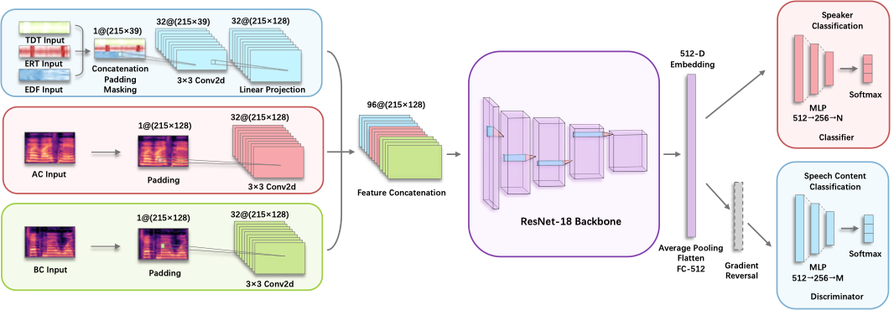

# Code — Coming Soon

Reference implementations of AuthG-Live and AuthG-Net, the feature extraction pipeline, the benchmark harness, and all re-implemented baselines.

## Planned layout

```
src/
├── features/          # AC/BC log-Mel; SF features: ERT, TDT, EDF
├── liveness/
│   ├── authg_live/    # ours — sound-field cosine similarity, genuine-only threshold
│   └── baselines/     # VOID, He et al. (2024), Boneauth, Eve Said Yes,
│                      # Li et al. (2021), Cafield, Voshield
├── auth/
│   ├── authg_net/     # ours — multi-modal CNN with domain-adversarial learning
│   └── baselines/     # Park et al. (2025), Eve Said Yes, Cafield, Voshield
├── benchmark/         # the 4 tasks, splits, metrics, result tables
└── live/              # streaming pipeline + Level 1/2 simplifications (Raspberry Pi)
```

## AuthG-Live in one paragraph

Most liveness detectors learn what *attacks* look like, so they inherit the blind spots of whatever attack set they were trained on. AuthG-Live instead models the physics of near-source sound propagation. TDT and ERT are averaged along time per channel to yield `aTDT` and `aERT`; averaging those over genuine samples gives a **unified pattern** describing how a real human voice propagates across the frame. An input is live only if the cosine similarity of both its `aTDT` and `aERT` to the unified patterns clears a threshold. Thresholds come from the 3rd percentile of the genuine similarity distribution — **0.9937** for aTDT and **0.9822** for aERT — accepting 97 % of genuine samples by construction.

The consequence: **no attack samples are needed for training**, so there is no attack set to overfit to, and the features stream frame by frame, which is what makes near-real-time detection possible.

## AuthG-Net in one paragraph

**What carries the performance here is the input representation and the training objective, not the network.** The backbone is a stock ResNet-18 used as a baseline encoder, and it is deliberately interchangeable — the contribution is what goes into it and what it is optimized for.

**What goes in.** Three complementary acoustic modalities, each with a lightweight encoder before fusion: AC and BC as log-Mel spectrograms, and SF as TDT, ERT, and EDF concatenated along time. Low-energy TDT frames are masked out using the AC signal energy, since delay estimates are unreliable where there is no signal to correlate.

**What it is optimized for.** Passphrase independence, via domain-adversarial learning. A speaker classifier trains on the embedding directly, while a passphrase classifier sits behind a Gradient Reversal Layer, giving `L = L_s − λ·L_p` with `λ = 1`. The reversed gradient pushes the encoder to discard content information and keep only speaker identity. This is what holds cross-utterance degradation to ~1 %, and it is backbone-agnostic.

At enrollment the embedding is stored as the user template; at test time cosine similarity against the template decides access. Exact layer shapes, padding sizes, and training hyperparameters are in the paper's appendix and will ship with the code.

<p align="center">
  
</p>

*Multi-modal fusion and the domain-adversarial branches: the three modality encoders feed a shared backbone that produces the user embedding; the speaker classifier attaches directly, while the passphrase classifier attaches through the Gradient Reversal Layer.*

## Live deployment

Latency is dominated by TDT/ERT, which need frame-wise cross-correlation and energy computation. Two simplification levels are provided:

- **Level 1** — compute TDT/ERT at 24 kHz. Processing latency stays under 4 s for inputs shorter than 3 s, but grows with input length.
- **Level 2** — use odd frames with padding to reconstruct full samples. Latency becomes near-constant at **~1.5–1.7 s regardless of input duration**, with time-delay accuracy preserved.

Everything else runs at 96 kHz. AC, BC, TDT, ERT, and EDF are processed as parallel streams in a multi-threaded pipeline, joined by a single inference thread.

Measured on a Raspberry Pi standing in for a constrained edge device: idle 2.56 W; per 3-second segment, feature extraction adds 2.32 W and inference 4.87 W, averaging **2.72 W** across the pipeline; memory stays under **267 MB**. A dedicated glasses SoC would do better.

## Requirements (expected)

Python ≥ 3.9, PyTorch, torchaudio, librosa, scikit-learn, NumPy, SciPy. A pinned `requirements.txt` ships with the code.

⭐ Watch this repository to be notified when the code lands.
